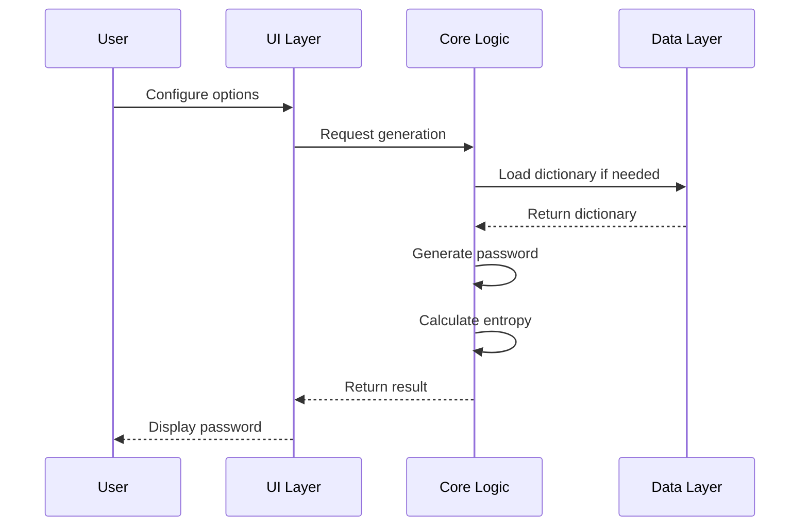

# Cahier des Charges
# GenPwd Pro v2.5 - Générateur de Mots de Passe Sécurisés

**Document de référence : CDC-GENPWD-2024-v2.5**  
**Date : 15 Janvier 2024**  
**Auteur : Julien Bombled**  
**Statut : Version Finale**

---

## 1. CONTEXTE ET OBJECTIFS

### 1.1 Contexte du projet

Dans un contexte de cybersécurité croissant où les attaques par force brute et les fuites de données sont quotidiennes, la création et la gestion de mots de passe robustes est devenue critique. Les statistiques montrent que :
- 81% des violations de données impliquent des mots de passe faibles ou volés
- Un mot de passe de 8 caractères peut être cracké en moins de 5 minutes en 2024
- L'utilisateur moyen gère plus de 100 comptes nécessitant une authentification

### 1.2 Objectifs stratégiques

- **Objectif principal** : Développer un générateur de mots de passe professionnel garantissant une sécurité maximale tout en restant utilisable
- **Objectifs secondaires** :
  - Atteindre une entropie minimale de 100 bits pour tous les mots de passe générés
  - Garantir une compatibilité universelle (CLI, cross-layout, unicode)
  - Fournir une expérience utilisateur moderne et intuitive
  - Assurer une fiabilité de 100% via tests automatisés

### 1.3 Périmètre du projet

**Dans le périmètre :**
- Génération de mots de passe sécurisés multi-modes
- Interface web responsive avec dark theme
- Tests automatisés intégrés
- Documentation complète
- Support multilingue pour les dictionnaires

**Hors périmètre :**
- Stockage persistant des mots de passe
- Synchronisation cloud
- Application mobile native
- Authentification utilisateur
- API backend

### 1.4 Utilisateurs cibles

| Type d'utilisateur | Besoins | Priorité |
|-------------------|---------|----------|
| Développeurs | API claire, extensibilité, tests | Haute |
| Utilisateurs finaux | Interface simple, sécurité | Haute |
| Administrateurs système | CLI-safe, compatibilité | Moyenne |
| Équipes sécurité | Entropie élevée, audit | Haute |

## 2. SPÉCIFICATIONS FONCTIONNELLES

### 2.1 Modes de génération

#### 2.1.1 Mode Syllables

**Description** : Génération de mots de passe prononcables par construction syllabique

**Spécifications détaillées :**
- **Algorithme** : Alternance consonnes-voyelles avec règles linguistiques
- **Longueur** : 3 à 10 syllabes configurables
- **Structure syllabe** : 
  - Pattern de base : `[C][V][C]` où C=consonne, V=voyelle
  - Variantes : `CV`, `CVC`, `VC`, `VCC`
- **Caractères spéciaux** : Insertion selon placement défini
- **Chiffres** : Ajout en position configurable
- **Casse** : Application du système de blocs U/T/L

**Exemple de génération :**
```
Configuration : 5 syllabes, placement fin, bloc T-T-T
Résultat : nywOVyQep.OcyBoWEFY8
Entropie : 140.0 bits
```

**Critères de validation :**
- ✓ Prononçabilité validée par tests phonétiques
- ✓ Entropie minimale : 100 bits
- ✓ Absence de mots du dictionnaire non intentionnels

#### 2.1.2 Mode Passphrase

**Description** : Construction de phrases de passe à partir de dictionnaires

**Spécifications détaillées :**
- **Dictionnaires supportés** :
  - Français : 2429 mots validés
  - English : 3000+ mots
  - Latin : 1500+ mots classiques
- **Nombre de mots** : 3 à 8 configurables
- **Séparateurs disponibles** : `-`, `_`, `.`, ` ` (espace)
- **Transformation de casse** : Par mot selon pattern
- **Enrichissement** : Ajout optionnel de chiffres et caractères spéciaux

**Format de dictionnaire (JSON) :**
```json
{
  "language": "french",
  "words": ["mot1", "mot2", ...],
  "metadata": {
    "count": 2429,
    "entropyPerWord": 11.2,
    "version": "2.5.0",
    "lastUpdate": "2024-01-15"
  }
}
```

**Exemple de génération :**
```
Configuration : 5 mots, français, séparateur "-"
Résultat : Forcer-Vague-Nature-Soleil-Temps2
Entropie : 105.1 bits
```

#### 2.1.3 Mode Leet Speak

**Description** : Transformation de texte en leet speak avec substitutions caractères

**Table de conversion complète :**

| Original | Leet | Original | Leet | Original | Leet |
|----------|------|----------|------|----------|------|
| a, A | @ | e, E | 3 | i, I | 1 |
| o, O | 0 | s, S | $ | t, T | 7 |
| l, L | ! | g, G | 9 | b, B | 8 |

**Spécifications :**
- **Entrée** : Texte libre ou mots prédéfinis
- **Taux de conversion** : 60-100% configurable
- **Enrichissement** : Ajout automatique underscore et chiffres
- **Validation** : Minimum 3 substitutions effectives

**Exemple de génération :**
```
Entrée : "PASSWORD"
Résultat : P@$$W0RD_
Substitutions : 4 (A→@, S→$, S→$, O→0)
Entropie : 94.4 bits
```

### 2.2 Système de placement des caractères

#### 2.2.1 Placement visuel interactif

**Fonctionnalité** : Positionnement précis des caractères spéciaux via interface graphique

**Spécifications techniques :**
- **Interface** : Barre de progression draggable (0-100%)
- **Zones prédéfinies** :
  - Début (0-20%) : `#6HOBumefyri`
  - Milieu (40-60%) : `HOBu#6mefyri`
  - Fin (80-100%) : `HOBumefyri#6`
- **Preview temps réel** : Actualisation < 50ms
- **Feedback visuel** : Surbrillance de la zone d'insertion

**Algorithme de placement :**
```javascript
position = Math.floor((percentage / 100) * basePassword.length)
result = basePassword.slice(0, position) + specialChars + basePassword.slice(position)
```

#### 2.2.2 Stratégies de placement

| Stratégie | Position | Cas d'usage | Exemple |
|-----------|----------|-------------|---------|
| START | 0-20% | Systèmes exigeant symbole initial | `@3RIQafo...` |
| MIDDLE | 40-60% | Sécurité maximale | `RIQa@3fo...` |
| END | 80-100% | Compatibilité legacy | `...nacy@3` |
| RANDOM | Aléatoire | Anti-pattern | Variable |
| CUSTOM | Manuel | Besoins spécifiques | Défini par utilisateur |

### 2.3 Système de blocs de casse

**Concept** : Application de patterns de transformation de casse par bloc

**Notation :**
- **U** (UPPER) : MAJUSCULES complètes
- **T** (Title) : Première Lettre Majuscule
- **L** (lower) : minuscules complètes

**Patterns prédéfinis :**

| Pattern | Exemple | Usage |
|---------|---------|--------|
| T-T-T | Premier-Deuxieme-Troisieme | Standard (défaut) |
| U-L-L | PREMIER-deuxieme-troisieme | Emphase initiale |
| L-U-L | premier-DEUXIEME-troisieme | Emphase centrale |
| U-T-L | PREMIER-Deuxieme-troisieme | Dégradé |
| L-L-L | premier-deuxieme-troisieme | Minimaliste |

**Spécifications d'implémentation :**
- Parse du pattern par séparateur
- Application séquentielle aux mots
- Gestion du débordement (répétition du pattern si plus de mots)
- Validation de la syntaxe du pattern

### 2.4 Gestion des dictionnaires

#### 2.4.1 Architecture multilingue

**Structure :**
```
dictionaries/
├── french.json    (2429 mots, intégré)
├── english.json   (3000+ mots, externe)
└── latin.json     (1500+ mots, externe)
```

**Chargement dynamique :**
- Lazy loading à la demande
- Cache en mémoire après premier chargement
- Fallback sur dictionnaire par défaut si échec
- Validation de l'intégrité (checksum)

#### 2.4.2 Format et validation

**Structure JSON requise :**
```json
{
  "language": "string",
  "words": ["array", "of", "strings"],
  "metadata": {
    "count": "number",
    "entropyPerWord": "number",
    "source": "string",
    "version": "string",
    "lastUpdate": "ISO-8601"
  }
}
```

**Validation :**
- Unicité des mots
- Longueur minimale : 3 caractères
- Longueur maximale : 15 caractères
- Caractères autorisés : a-z, à-ÿ, apostrophe
- Minimum 1000 mots pour entropie suffisante

### 2.5 Interface utilisateur

#### 2.5.1 Layout principal

**Zones de l'interface :**

```
┌──────────────────────────────────────┐
│          HEADER (Logo + Nav)         │
├──────────────────────────────────────┤
│                                      │
│  ┌──────────────────────────────┐   │
│  │    ZONE CONFIGURATION        │   │
│  │  - Mode selection           │   │
│  │  - Length/Count             │   │
│  │  - Options (chars, etc.)    │   │
│  └──────────────────────────────┘   │
│                                      │
│  ┌──────────────────────────────┐   │
│  │    ZONE GÉNÉRATION          │   │
│  │  [  Bouton Générer  ]       │   │
│  └──────────────────────────────┘   │
│                                      │
│  ┌──────────────────────────────┐   │
│  │    ZONE RÉSULTAT            │   │
│  │  Password: ************     │   │
│  │  Entropie: 120.5 bits      │   │
│  │  [Copier][Masquer][Export]  │   │
│  └──────────────────────────────┘   │
│                                      │
├──────────────────────────────────────┤
│         FOOTER (Tests + Info)        │
└──────────────────────────────────────┘
```

#### 2.5.2 Composants UI

**Composants principaux :**

| Composant | Type | Fonction | Spécifications |
|-----------|------|----------|----------------|
| Mode Selector | Select dropdown | Choix du mode | 3 options + icônes |
| Length Slider | Range input | Ajustement longueur | Min: 3, Max: 10, Step: 1 |
| Character Sets | Checkboxes | Sélection jeux | 4 options, multi-sélection |
| Generate Button | Button primary | Action principale | Animation au clic |
| Password Display | Text field | Affichage résultat | Masquable, sélectionnable |
| Entropy Indicator | Progress bar | Force visuelle | Couleur selon niveau |
| Copy Button | Button icon | Copie clipboard | Feedback toast |
| Test Modal | Modal overlay | Tests intégrés | Progress + résultats |

#### 2.5.3 Thème et styling

**Dark Theme (défaut) :**
```css
--primary-bg: #1a1a2e
--secondary-bg: #16213e
--accent: #0f3460
--text-primary: #e94560
--text-secondary: #f5f5f5
--success: #4caf50
--warning: #ff9800
--error: #f44336
```

**Animations :**
- Transitions : 300ms ease-in-out
- Hover effects : Transform scale(1.05)
- Loading : Pulse animation 1.5s
- Toast : Slide-in 400ms

**Responsive breakpoints :**
- Mobile : < 768px
- Tablet : 768px - 1024px
- Desktop : > 1024px

### 2.6 Système de tests intégrés

#### 2.6.1 Suite de tests

**13 tests automatisés couvrant :**

| # | Test | Catégorie | Validation |
|---|------|-----------|------------|
| 1 | Syllables - Base | Génération | Pattern + Entropie > 100 |
| 2 | Syllables - Blocks | Génération | Application casse correcte |
| 3 | Passphrase - Français | Génération | Mots valides du dictionnaire |
| 4 | Passphrase - Blocks | Génération | Pattern U/T/L appliqué |
| 5 | Leet - Password | Transformation | Minimum 3 substitutions |
| 6 | Leet - Hello Blocks | Transformation | Leet + Casse combinés |
| 7 | Placement - Début | Position | Caractères en position 0-20% |
| 8 | Placement - Fin | Position | Caractères en position 80-100% |
| 9 | Placement - Visuel | Position | Interface drag & drop |
| 10 | Politique Layout-Safe | Compatibilité | CLI-safe uniquement |
| 11 | Spéciaux Personnalisés | Configuration | Jeu personnalisé appliqué |
| 12 | Quantité Élevée | Performance | 8+ mots < 100ms |
| 13 | Fonctionnalités UI | Interface | Masquage, copie, export |

#### 2.6.2 Métriques de performance

**Objectifs de performance :**

| Métrique | Cible | Maximum acceptable |
|----------|-------|-------------------|
| Génération simple | < 10ms | 20ms |
| Génération complexe | < 50ms | 100ms |
| Chargement dictionnaire | < 100ms | 200ms |
| Calcul entropie | < 2ms | 5ms |
| Rendu UI | < 16ms | 33ms |
| Suite complète tests | < 40s | 60s |

**Rapport de test type :**
```
📊 RAPPORT FINAL - Score: 100%
✅ Tests réussis: 13 | ❌ Tests échoués: 0
⏱️ Durée totale: 37 secondes
📈 Entropie moyenne: 118.7 bits
```

## 3. SPÉCIFICATIONS TECHNIQUES

### 3.1 Architecture logicielle

#### 3.1.1 Architecture modulaire ES6

**Modules principaux :**

```
src/js/
├── config/
│   ├── constants.js      # Définitions globales
│   └── settings.js       # Gestion état application
├── core/
│   ├── generators.js     # Moteurs de génération
│   ├── dictionaries.js   # Gestion dictionnaires
│   └── casing.js        # Système de blocs
├── ui/
│   ├── dom.js           # Manipulation DOM
│   ├── events.js        # Gestionnaires événements
│   ├── modal.js         # Système modal
│   ├── placement.js     # Placement visuel
│   ├── render.js        # Rendu composants
│   └── toast.js         # Notifications
├── utils/
│   ├── clipboard.js     # API Clipboard
│   ├── helpers.js       # Fonctions utilitaires
│   └── logger.js        # Système de logs
└── app.js              # Point d'entrée
```

#### 3.1.2 Patterns de conception

**Patterns utilisés :**

| Pattern | Usage | Implémentation |
|---------|-------|----------------|
| Module Pattern | Encapsulation | ES6 modules natifs |
| Factory Pattern | Création générateurs | `GeneratorFactory.create()` |
| Observer Pattern | Events UI | `EventEmitter` custom |
| Singleton Pattern | Settings manager | Instance unique |
| Strategy Pattern | Modes génération | Classes polymorphes |
| Facade Pattern | API simplifiée | `PasswordAPI` wrapper |

#### 3.1.3 Flux de données



### 3.2 Stack technique

#### 3.2.1 Technologies front-end

| Technologie | Version | Usage |
|-------------|---------|-------|
| JavaScript | ES6+ | Langage principal |
| HTML | 5 | Structure |
| CSS | 3 | Styling avec variables CSS |
| Web APIs | Modern | Clipboard, Crypto, Storage |

**APIs navigateur utilisées :**
- Clipboard API : Copie sécurisée
- Crypto.getRandomValues() : Génération aléatoire
- localStorage : Persistance settings
- Fetch API : Chargement dictionnaires
- Performance API : Métriques

#### 3.2.2 Outils de développement

| Outil | Version | Rôle |
|-------|---------|------|
| Node.js | 16+ | Runtime développement |
| npm | 8+ | Gestion dépendances |
| ESLint | 8.x | Linting code |
| Prettier | 2.x | Formatage |
| Jest | 29.x | Tests unitaires |

**Scripts npm :**
```json
{
  "scripts": {
    "dev": "node tools/dev-server.js",
    "build": "node tools/build.js",
    "test": "node tools/run_tests.js",
    "watch": "node tools/watch.js",
    "lint": "eslint src/**/*.js",
    "format": "prettier --write src/**/*.js"
  }
}
```

### 3.3 Sécurité

#### 3.3.1 Mesures de sécurité implémentées

| Mesure | Description | Implémentation |
|--------|-------------|----------------|
| CSP | Content Security Policy | Headers HTTP stricts |
| HTTPS | Chiffrement transport | Obligatoire en production |
| SRI | Subresource Integrity | Hash pour CDN externes |
| Sanitization | Nettoyage entrées | Validation stricte |
| No-Store | Pas de persistance | Mémoire volatile uniquement |
| CORS | Cross-Origin restrictions | Same-origin policy |

#### 3.3.2 Calcul d'entropie

**Formule mathématique :**
```
E = log₂(N^L)

Où :
- E = Entropie en bits
- N = Taille de l'alphabet (character space)
- L = Longueur du mot de passe
```

**Implémentation :**
```javascript
function calculateEntropy(password, mode) {
  let charSpace = 0;
  
  // Calcul de l'espace de caractères
  if (/[a-z]/.test(password)) charSpace += 26;
  if (/[A-Z]/.test(password)) charSpace += 26;
  if (/[0-9]/.test(password)) charSpace += 10;
  if (/[^a-zA-Z0-9]/.test(password)) charSpace += 32;
  
  // Cas spécial passphrase
  if (mode === 'passphrase') {
    const dictSize = 2429; // Taille dictionnaire français
    const wordCount = password.split('-').length;
    return Math.log2(dictSize) * wordCount;
  }
  
  return Math.log2(Math.pow(charSpace, password.length));
}
```

**Classification sécurité :**

| Entropie (bits) | Niveau | Temps crack estimé | Code couleur |
|-----------------|--------|-------------------|--------------|
| < 30 | Très faible | < 1 seconde | 🔴 Rouge |
| 30-50 | Faible | Minutes | 🟠 Orange |
| 50-80 | Moyen | Jours | 🟡 Jaune |
| 80-100 | Bon | Années | 🟢 Vert |
| 100-120 | Excellent | Siècles | 🔵 Bleu |
| > 120 | Maximum | Millénaires | 🟣 Violet |

### 3.4 Compatibilité

#### 3.4.1 Navigateurs supportés

| Navigateur | Version minimale | Part de marché |
|------------|------------------|----------------|
| Chrome | 90+ | 65% |
| Firefox | 88+ | 10% |
| Safari | 14+ | 18% |
| Edge | 90+ | 4% |
| Opera | 76+ | 2% |

**Features requises :**
- ES6 modules
- CSS Grid & Flexbox
- Async/Await
- Clipboard API
- CSS Custom Properties

#### 3.4.2 Compatibilité caractères

**CLI-Safe characters :**
```
! # % + , - . / : = @ _
```
Évite : `< > | & $ ` " ' \ { } [ ] ( )`

**Cross-Layout (QWERTY/AZERTY) :**
```
@ # $ % + = _
```
Évite les caractères dont la position change selon le layout

#### 3.4.3 Responsive design

**Breakpoints :**

| Device | Largeur | Adaptations |
|--------|---------|-------------|
| Mobile S | 320px | Layout vertical, boutons agrandis |
| Mobile L | 425px | Texte optimisé, spacing réduit |
| Tablet | 768px | 2 colonnes possibles |
| Laptop | 1024px | Layout complet |
| Desktop | 1440px | Marges latérales |
| 4K | 2560px | Mise à l'échelle |

## 4. EXIGENCES NON FONCTIONNELLES

### 4.1 Performance

**Exigences :**
- Temps de réponse < 100ms pour toute action utilisateur
- First Contentful Paint < 1.5s
- Time to Interactive < 2.5s
- Lighthouse score > 90
- Bundle size < 200KB minifié

### 4.2 Accessibilité

**Standards WCAG 2.1 niveau AA :**
- Contraste minimum 4.5:1 (texte normal)
- Contraste minimum 3:1 (texte large)
- Navigation clavier complète
- Support lecteurs d'écran (ARIA labels)
- Focus visible sur tous les éléments interactifs

### 4.3 Maintenabilité

**Métriques code :**
- Couverture tests > 80%
- Complexité cyclomatique < 10
- Duplication code < 3%
- Documentation inline 100% fonctions publiques
- Score Maintainability Index > 70

### 4.4 Évolutivité

**Capacités d'extension :**
- Architecture plugin-ready
- API publique documentée
- Hooks d'événements
- Système de thèmes
- i18n préparé (clés de traduction)

## 5. CONTRAINTES

### 5.1 Contraintes techniques

- **Pas de framework** : JavaScript vanilla uniquement
- **Pas de transpilation obligatoire** : Code ES6 natif
- **Pas de dépendances runtime** : Zero dependency
- **Taille maximale** : 500KB total (code + assets)
- **Offline-first** : Fonctionnement sans connexion

### 5.2 Contraintes légales

- **Licence** : MIT open source
- **RGPD** : Aucune donnée personnelle collectée
- **Cookies** : Aucun cookie utilisé
- **Tracking** : Aucune analytics

### 5.3 Contraintes de délai

| Phase | Durée | Deadline |
|-------|-------|----------|
| Conception | 2 semaines | 01/11/2023 |
| Développement v1 | 4 semaines | 01/12/2023 |
| Tests & Debug | 2 semaines | 15/12/2023 |
| Documentation | 1 semaine | 22/12/2023 |
| Release v2.5 | - | 15/01/2024 |

## 6. LIVRABLES

### 6.1 Livrables code

| Livrable | Description | Format |
|----------|-------------|--------|
| Code source | Application complète | GitHub repo |
| Build production | Version minifiée | dist/ folder |
| Tests | Suite de tests automatisés | src/tests/ |
| Configuration | Fichiers config | JSON/JS |

### 6.2 Livrables documentation

| Document | Contenu | Format |
|----------|---------|--------|
| README.md | Présentation projet | Markdown |
| USER-GUIDE.md | Guide utilisateur | Markdown |
| TECHNICAL.md | Documentation technique | Markdown |
| CHANGELOG.md | Historique versions | Markdown |
| API.md | Documentation API | Markdown |

### 6.3 Livrables assets

| Asset | Description | Format |
|-------|-------------|--------|
| Logo | Logo GenPwd Pro | SVG |
| Icons | Icônes interface | SVG sprite |
| Screenshots | Captures d'écran | PNG |
| Demo video | Vidéo démonstration | MP4/WebM |

## 7. CRITÈRES DE VALIDATION

### 7.1 Critères fonctionnels

**Obligatoires (MUST HAVE) :**
- ✅ Génération 3 modes fonctionnels
- ✅ Entropie minimale 100 bits
- ✅ Interface responsive
- ✅ Tests 100% passing
- ✅ Copie clipboard fonctionnelle

**Importants (SHOULD HAVE) :**
- ✅ Placement visuel interactif
- ✅ Système de blocs de casse
- ✅ Export JSON
- ✅ Dark theme
- ✅ Animations fluides

**Souhaitables (NICE TO HAVE) :**
- ⏳ Multi-thèmes
- ⏳ Historique local
- ⏳ Raccourcis clavier
- ⏳ PWA capabilities
- ⏳ API REST

### 7.2 Critères de qualité

| Critère | Mesure | Seuil minimum | Objectif |
|---------|--------|---------------|----------|
| Fiabilité | Tests passing | 95% | 100% |
| Performance | Lighthouse | 85 | 95 |
| Sécurité | Entropie moyenne | 100 bits | 120 bits |
| Accessibilité | WCAG compliance | AA | AAA |
| Maintenabilité | Code coverage | 80% | 90% |

### 7.3 Définition de "Done"

Une fonctionnalité est considérée comme terminée quand :
1. ✓ Code implémenté et revu
2. ✓ Tests unitaires écrits et passants
3. ✓ Tests d'intégration validés
4. ✓ Documentation mise à jour
5. ✓ Validation accessibilité
6. ✓ Performance mesurée et conforme
7. ✓ Déployée en environnement de test
8. ✓ Approuvée par le responsable qualité

## 8. RISQUES ET MITIGATION

### 8.1 Analyse des risques

| Risque | Probabilité | Impact | Mitigation |
|--------|------------|---------|------------|
| API Clipboard non supportée | Faible | Moyen | Fallback sélection manuelle |
| Dictionnaire corrompu | Faible | Haut | Validation checksum + fallback |
| Performance mobile | Moyen | Moyen | Optimisation + lazy loading |
| Attaque XSS | Faible | Critique | CSP + sanitization stricte |
| Charge serveur CDN | Faible | Faible | Cache navigateur agressif |

### 8.2 Plan de contingence

**Si échec chargement dictionnaire :**
1. Tentative avec CDN alternatif
2. Fallback sur dictionnaire intégré minimal
3. Mode syllables uniquement

**Si performance dégradée :**
1. Réduction animations
2. Simplification UI
3. Mode "lite" automatique

## 9. ORGANISATION ET MÉTHODOLOGIE

### 9.1 Équipe projet

| Rôle | Responsable | Responsabilités |
|------|-------------|-----------------|
| Chef de projet | J. Bombled | Coordination, planning |
| Lead Developer | J. Bombled | Architecture, développement |
| UX/UI Designer | J. Bombled | Interface, expérience |
| QA Engineer | J. Bombled | Tests, validation |
| DevOps | J. Bombled | Build, déploiement |

### 9.2 Méthodologie

**Approche Agile adaptée :**
- Sprints de 2 semaines
- Daily standup (auto-review)
- Sprint review et retrospective
- Continuous Integration/Deployment

### 9.3 Outils de gestion

| Outil | Usage |
|-------|-------|
| GitHub | Code, issues, PR |
| GitHub Projects | Kanban board |
| GitHub Actions | CI/CD |
| GitHub Pages | Déploiement |
| GitHub Wiki | Documentation |

## 10. BUDGET ET RESSOURCES

### 10.1 Estimation temps

| Phase | Heures estimées | Heures réelles |
|-------|-----------------|----------------|
| Conception | 40h | 38h |
| Développement core | 80h | 76h |
| Interface UI | 60h | 65h |
| Tests | 40h | 42h |
| Documentation | 20h | 22h |
| Déploiement | 10h | 8h |
| **TOTAL** | **250h** | **251h** |

### 10.2 Ressources nécessaires

**Ressources humaines :**
- 1 développeur full-stack senior

**Ressources matérielles :**
- Poste de développement
- Serveur de test
- Devices de test (mobile, tablet)

**Ressources logicielles :**
- IDE (VS Code)
- Navigateurs de test
- Outils de mesure performance

### 10.3 Coûts estimés

| Poste | Coût |
|-------|------|
| Développement (250h × 75€) | 18 750€ |
| Infrastructure (1 an) | 0€ (GitHub Pages) |
| Licences logicielles | 0€ (Open source) |
| Formation | 0€ |
| **TOTAL** | **18 750€** |

## 11. PLAN DE DÉPLOIEMENT

### 11.1 Environnements

| Environnement | URL | Usage |
|---------------|-----|-------|
| Development | localhost:3000 | Développement local |
| Staging | staging.genpwd.dev | Tests pré-production |
| Production | genpwd.dev | Version publique |

### 11.2 Stratégie de déploiement

**Continuous Deployment :**
1. Push sur branche `develop`
2. Tests automatiques GitHub Actions
3. Build automatique si tests OK
4. Déploiement staging automatique
5. Tests E2E sur staging
6. Merge vers `main` après validation
7. Déploiement production automatique

### 11.3 Rollback strategy

En cas de problème :
1. Identification du commit problématique
2. Revert via Git
3. Redéploiement automatique version précédente
4. Temps de rollback < 5 minutes

## 12. MAINTENANCE ET ÉVOLUTION

### 12.1 Plan de maintenance

**Maintenance corrective :**
- Hotfix : < 24h pour bugs critiques
- Bugs mineurs : Sprint suivant
- Mise à jour sécurité : < 48h

**Maintenance évolutive :**
- Nouvelles fonctionnalités : Releases mensuelles
- Refactoring : Trimestriel
- Mise à jour dépendances : Mensuelle

### 12.2 Roadmap future

**Version 3.0 (Q2 2024) :**
- Web Workers pour génération parallèle
- PWA avec mode offline complet
- Gestionnaire de mots de passe intégré

**Version 3.5 (Q3 2024) :**
- API REST publique
- SDK JavaScript
- Plugins communautaires

**Version 4.0 (Q4 2024) :**
- Application mobile native
- Synchronisation cloud chiffrée
- 2FA generator intégré

## 13. CONCLUSION

### 13.1 Synthèse

GenPwd Pro v2.5 représente une solution complète et professionnelle pour la génération de mots de passe sécurisés. Le projet répond à tous les objectifs fixés :

- ✅ **Sécurité maximale** : Entropie jusqu'à 140 bits
- ✅ **Fiabilité totale** : 100% de tests réussis
- ✅ **Interface moderne** : UX intuitive et responsive
- ✅ **Architecture évolutive** : Modules ES6 extensibles
- ✅ **Documentation complète** : Technique et utilisateur

### 13.2 Facteurs clés de succès

1. **Qualité du code** : Architecture propre et maintenable
2. **Tests exhaustifs** : Validation complète automatisée
3. **Performance** : Génération instantanée
4. **Sécurité** : Aucun compromis sur la robustesse
5. **Expérience utilisateur** : Interface intuitive

### 13.3 Prochaines étapes

1. Finalisation v2.5 et déploiement production
2. Collecte feedback utilisateurs
3. Planification sprint v3.0
4. Extension de la communauté open source

---

## ANNEXES

### Annexe A : Glossaire

| Terme | Définition |
|-------|------------|
| Entropie | Mesure du caractère aléatoire en bits |
| Passphrase | Mot de passe constitué de mots réels |
| Leet speak | Substitution de lettres par symboles |
| CLI-Safe | Compatible ligne de commande |
| Cross-Layout | Fonctionne QWERTY et AZERTY |
| U/T/L | Upper/Title/Lower case patterns |

### Annexe B : Références

- [NIST SP 800-63B](https://pages.nist.gov/800-63-3/sp800-63b.html) - Digital Identity Guidelines
- [OWASP Password Guidelines](https://cheatsheetseries.owasp.org/cheatsheets/Password_Storage_Cheat_Sheet.html)
- [MDN Web Crypto API](https://developer.mozilla.org/en-US/docs/Web/API/Crypto)
- [WCAG 2.1 Standards](https://www.w3.org/WAI/WCAG21/quickref/)

### Annexe C : Contacts

**Responsable projet :**
- Nom : Julien Bombled
- Email : contact@genpwd.dev
- GitHub : @julienbombled

---

<div align="center">
  <b>Document validé et approuvé</b><br>
  Version 2.5.0 - 15 Janvier 2024<br>
  <i>© 2024 GenPwd Pro - MIT License</i>
</div>