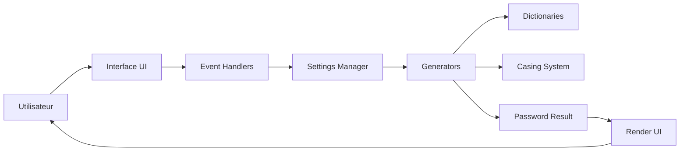

# Documentation Technique - GenPwd Pro v2.5

> Architecture, API et guide d'extension pour développeurs

## Architecture modulaire ES6

### Vue d'ensemble

GenPwd Pro utilise une architecture modulaire ES6 stricte avec séparation des responsabilités :

```
┌─────────────────────────────────────────┐
│             app.js (Entry)              │
├─────────────┬──────────────┬────────────┤
│   CONFIG    │     CORE     │     UI     │
├─────────────┼──────────────┼────────────┤
│ constants   │ generators   │ dom        │
│ settings    │ dictionaries │ events     │
│             │ casing       │ modal      │
│             │              │ placement  │
│             │              │ render     │
│             │              │ toast      │
├─────────────┴──────────────┴────────────┤
│                UTILS                     │
├──────────────────────────────────────────┤
│  clipboard │ helpers │ logger            │
└──────────────────────────────────────────┘
```

### Flux de données



## API des modules principaux

### Module `generators.js`

```javascript
// Interface principale de génération
export class PasswordGenerator {
  /**
   * Génère un mot de passe selon le mode spécifié
   * @param {Object} options - Configuration de génération
   * @param {string} options.mode - 'syllables' | 'passphrase' | 'leet'
   * @param {number} options.length - Nombre d'unités à générer
   * @param {Object} options.charsets - Jeux de caractères actifs
   * @param {string} options.blocks - Pattern de casse (ex: "U-T-L")
   * @returns {GeneratorResult} Résultat avec password et metadata
   */
  generate(options) { }

  /**
   * Génération par syllables prononcables
   * @private
   * @param {number} count - Nombre de syllables
   * @returns {string[]} Tableau de syllables
   */
  generateSyllables(count) { }

  /**
   * Génération par mots du dictionnaire
   * @private
   * @param {number} count - Nombre de mots
   * @param {string} lang - Code langue ('fr', 'en', 'la')
   * @returns {Promise<string[]>} Promesse de tableau de mots
   */
  async generatePassphrase(count, lang) { }

  /**
   * Transformation en leet speak
   * @private
   * @param {string} text - Texte à transformer
   * @returns {string} Texte en leet
   */
  toLeetSpeak(text) { }
}

// Type de retour
interface GeneratorResult {
  password: string;
  entropy: number;
  metadata: {
    mode: string;
    length: number;
    charsets: string[];
    timestamp: Date;
  };
}
```

### Module `dictionaries.js`

```javascript
export class DictionaryManager {
  /**
   * Charge un dictionnaire de manière asynchrone
   * @param {string} language - Code langue
   * @returns {Promise<Dictionary>} Dictionnaire chargé
   */
  async loadDictionary(language) { }

  /**
   * Obtient un mot aléatoire du dictionnaire
   * @param {string} language - Code langue
   * @returns {string} Mot aléatoire
   */
  getRandomWord(language) { }

  /**
   * Valide l'intégrité d'un dictionnaire
   * @param {Dictionary} dict - Dictionnaire à valider
   * @returns {ValidationResult} Résultat de validation
   */
  validateDictionary(dict) { }
}

// Structure d'un dictionnaire
interface Dictionary {
  language: string;
  words: string[];
  metadata: {
    count: number;
    entropyPerWord: number;
    lastUpdate: Date;
  };
}
```

### Module `casing.js`

```javascript
export class CasingSystem {
  /**
   * Applique un pattern de casse à un tableau de mots
   * @param {string[]} words - Mots à transformer
   * @param {string} pattern - Pattern U/T/L (ex: "U-T-L")
   * @returns {string[]} Mots avec casse appliquée
   */
  applyPattern(words, pattern) { }

  /**
   * Parse un pattern en instructions
   * @private
   * @param {string} pattern - Pattern brut
   * @returns {CaseInstruction[]} Instructions parsées
   */
  parsePattern(pattern) { }
}

// Types de casse
enum CaseType {
  UPPER = 'U',  // MAJUSCULES
  TITLE = 'T',  // Title Case
  LOWER = 'L'   // minuscules
}
```

### Module `placement.js`

```javascript
export class PlacementEngine {
  /**
   * Positionne les caractères spéciaux selon la stratégie
   * @param {string} base - Mot de passe de base
   * @param {string[]} special - Caractères à placer
   * @param {PlacementStrategy} strategy - Stratégie de placement
   * @returns {string} Mot de passe avec placement
   */
  placeCharacters(base, special, strategy) { }

  /**
   * Calcule la position optimale
   * @param {number} percentage - Position en pourcentage (0-100)
   * @param {number} length - Longueur totale
   * @returns {number} Index de placement
   */
  calculatePosition(percentage, length) { }
}

// Stratégies de placement
enum PlacementStrategy {
  START = 'start',      // Début (0-20%)
  MIDDLE = 'middle',    // Milieu (40-60%)
  END = 'end',          // Fin (80-100%)
  CUSTOM = 'custom',    // Position personnalisée
  RANDOM = 'random'     // Aléatoire
}
```

## Système de configuration

### Structure `constants.js`

```javascript
export const CONFIG = {
  // Limites système
  LIMITS: {
    MIN_LENGTH: 3,
    MAX_LENGTH: 10,
    MIN_WORDS: 3,
    MAX_WORDS: 8,
    MAX_ENTROPY: 256
  },

  // Jeux de caractères
  CHAR_SETS: {
    lowercase: 'abcdefghijklmnopqrstuvwxyz',
    uppercase: 'ABCDEFGHIJKLMNOPQRSTUVWXYZ',
    digits: '0123456789',
    special: '@#$%^&*_+=-',
    cli_safe: '!#%+,-./:=@_',  // Compatible ligne de commande
    cross_layout: '@#$%+=_'     // QWERTY/AZERTY safe
  },

  // Table de conversion leet
  LEET_MAP: {
    'a': '@', 'A': '@',
    'e': '3', 'E': '3',
    'i': '1', 'I': '1',
    'o': '0', 'O': '0',
    's': '$', 'S': '$',
    't': '7', 'T': '7',
    'l': '!', 'L': '!',
    'g': '9', 'G': '9'
  },

  // Configuration par défaut
  DEFAULTS: {
    mode: 'syllables',
    length: 5,
    dictionary: 'french',
    placement: 'end',
    blocks: 'T-T-T'
  }
};
```

### Gestionnaire `settings.js`

```javascript
export class SettingsManager {
  constructor() {
    this.state = { ...CONFIG.DEFAULTS };
    this.validators = new Map();
  }

  /**
   * Met à jour un paramètre avec validation
   * @param {string} key - Clé du paramètre
   * @param {any} value - Nouvelle valeur
   * @throws {ValidationError} Si validation échoue
   */
  update(key, value) {
    const validator = this.validators.get(key);
    if (validator && !validator(value)) {
      throw new ValidationError(`Invalid value for ${key}: ${value}`);
    }
    this.state[key] = value;
    this.persist();
  }

  /**
   * Enregistre un validateur personnalisé
   * @param {string} key - Clé du paramètre
   * @param {Function} validator - Fonction de validation
   */
  registerValidator(key, validator) {
    this.validators.set(key, validator);
  }

  /**
   * Sauvegarde l'état dans localStorage
   * @private
   */
  persist() {
    localStorage.setItem('genpwd_settings', JSON.stringify(this.state));
  }

  /**
   * Restaure l'état depuis localStorage
   */
  restore() {
    const saved = localStorage.getItem('genpwd_settings');
    if (saved) {
      this.state = { ...CONFIG.DEFAULTS, ...JSON.parse(saved) };
    }
  }
}
```

## Calcul d'entropie

### Formule mathématique

```
Entropie = log2(N^L)

Où :
- N = Taille de l'espace de caractères
- L = Longueur du mot de passe
```

### Implémentation

```javascript
export class EntropyCalculator {
  /**
   * Calcule l'entropie d'un mot de passe
   * @param {string} password - Mot de passe
   * @param {Object} context - Contexte de génération
   * @returns {number} Entropie en bits
   */
  calculate(password, context = {}) {
    const charSpace = this.getCharacterSpace(password);
    const length = password.length;
    
    // Calcul de base
    let entropy = Math.log2(Math.pow(charSpace, length));
    
    // Ajustements contextuels
    if (context.dictionary) {
      // Pour passphrase : log2(dictSize) * wordCount
      const dictSize = context.dictionary.wordCount;
      const wordCount = context.wordCount;
      entropy = Math.log2(dictSize) * wordCount;
    }
    
    // Bonus pour complexité
    entropy += this.getComplexityBonus(password);
    
    return Math.round(entropy * 10) / 10; // Arrondi à 0.1
  }

  /**
   * Détermine l'espace de caractères utilisé
   * @private
   */
  getCharacterSpace(password) {
    let space = 0;
    if (/[a-z]/.test(password)) space += 26;
    if (/[A-Z]/.test(password)) space += 26;
    if (/[0-9]/.test(password)) space += 10;
    if (/[^a-zA-Z0-9]/.test(password)) space += 32;
    return space;
  }

  /**
   * Calcule un bonus de complexité
   * @private
   */
  getComplexityBonus(password) {
    let bonus = 0;
    
    // Variation de casse
    if (/[a-z]/.test(password) && /[A-Z]/.test(password)) bonus += 2;
    
    // Mix alphanumérique
    if (/[a-zA-Z]/.test(password) && /[0-9]/.test(password)) bonus += 2;
    
    // Caractères spéciaux multiples
    const specials = password.match(/[^a-zA-Z0-9]/g);
    if (specials && specials.length > 2) bonus += 3;
    
    return bonus;
  }
}
```

### Niveaux de sécurité

| Entropie (bits) | Niveau | Temps de crack (2024) |
|-----------------|--------|----------------------|
| < 30 | ⚠️ Très faible | Instantané |
| 30-50 | 🟡 Faible | Minutes |
| 50-80 | 🟢 Correct | Jours/Semaines |
| 80-100 | 🔵 Bon | Années |
| 100-120 | 🟣 Excellent | Millénaires |
| > 120 | 🔒 Maximum | Temps astronomique |

## Système de tests

### Architecture des tests

```javascript
export class TestSuite {
  constructor() {
    this.tests = new Map();
    this.results = [];
  }

  /**
   * Enregistre un test
   * @param {string} name - Nom du test
   * @param {TestCase} testCase - Cas de test
   */
  register(name, testCase) {
    this.tests.set(name, testCase);
  }

  /**
   * Execute tous les tests
   * @returns {Promise<TestReport>} Rapport de tests
   */
  async runAll() {
    for (const [name, test] of this.tests) {
      const result = await this.runTest(name, test);
      this.results.push(result);
    }
    return this.generateReport();
  }

  /**
   * Execute un test spécifique
   * @private
   */
  async runTest(name, test) {
    const startTime = performance.now();
    try {
      await test.execute();
      return {
        name,
        status: 'success',
        duration: performance.now() - startTime
      };
    } catch (error) {
      return {
        name,
        status: 'failure',
        error: error.message,
        duration: performance.now() - startTime
      };
    }
  }
}

// Structure d'un test
interface TestCase {
  description: string;
  category: 'unit' | 'integration' | 'e2e';
  execute: () => Promise<void>;
  assertions: Assertion[];
}
```

### Tests critiques

```javascript
// Test de génération par syllables
test('Syllables Generation', async () => {
  const generator = new PasswordGenerator();
  const result = generator.generate({
    mode: 'syllables',
    length: 5
  });
  
  assert(result.password.length >= 10, 'Longueur minimale');
  assert(result.entropy > 100, 'Entropie suffisante');
  assert(/[A-Z]/.test(result.password), 'Contient majuscules');
  assert(/[0-9]/.test(result.password), 'Contient chiffres');
});

// Test de placement
test('Character Placement', async () => {
  const engine = new PlacementEngine();
  const result = engine.placeCharacters('password', ['@', '#'], 'start');
  
  assert(result.startsWith('@') || result.startsWith('#'), 
         'Caractère spécial au début');
});

// Test de dictionnaire
test('Dictionary Loading', async () => {
  const manager = new DictionaryManager();
  const dict = await manager.loadDictionary('french');
  
  assert(dict.words.length === 2429, 'Nombre de mots correct');
  assert(dict.metadata.entropyPerWord > 11, 'Entropie par mot');
});
```

## Extensibilité

### Ajout d'un nouveau mode de génération

1. **Créer le générateur** dans `generators.js` :

```javascript
export class CustomGenerator extends BaseGenerator {
  generate(options) {
    // Votre logique de génération
    const password = this.customAlgorithm(options);
    
    return {
      password,
      entropy: this.calculateEntropy(password),
      metadata: this.getMetadata(options)
    };
  }
  
  customAlgorithm(options) {
    // Implémentation spécifique
  }
}
```

2. **Enregistrer le mode** dans `app.js` :

```javascript
GeneratorFactory.register('custom', CustomGenerator);
```

3. **Ajouter l'UI** dans `index.html` :

```html
<option value="custom">Mon Mode Custom</option>
```

### Ajout d'un nouveau dictionnaire

1. **Créer le fichier JSON** :

```json
{
  "language": "esperanto",
  "words": ["saluton", "mondo", "amo", ...],
  "metadata": {
    "source": "Esperanto Academy",
    "version": "1.0",
    "lastUpdate": "2024-01-15"
  }
}
```

2. **Déclarer dans la configuration** :

```javascript
DICTIONARIES.register({
  code: 'eo',
  name: 'Esperanto',
  path: '/dictionaries/esperanto.json',
  fallback: 'english'
});
```

3. **Ajouter les traductions UI** si nécessaire

### Création d'un plugin

Structure d'un plugin GenPwd :

```javascript
export class MyPlugin {
  constructor(app) {
    this.app = app;
    this.name = 'MyPlugin';
    this.version = '1.0.0';
  }

  // Point d'entrée
  init() {
    this.registerHooks();
    this.extendUI();
  }

  // Enregistrement des hooks
  registerHooks() {
    this.app.on('beforeGenerate', this.beforeGenerate.bind(this));
    this.app.on('afterGenerate', this.afterGenerate.bind(this));
  }

  // Modification pre-génération
  beforeGenerate(options) {
    // Modifier les options
    return options;
  }

  // Post-traitement
  afterGenerate(result) {
    // Enrichir le résultat
    result.customData = this.analyze(result.password);
    return result;
  }

  // Extension de l'interface
  extendUI() {
    const container = document.querySelector('.plugins');
    container.appendChild(this.createUI());
  }
}
```

## Build et déploiement

### Process de build

```javascript
// tools/build.js
const build = async () => {
  // 1. Transpilation ES6 → ES5 (optionnel)
  await transpile('./src', './dist');
  
  // 2. Bundling des modules
  await bundle({
    entry: './src/js/app.js',
    output: './dist/bundle.js',
    format: 'iife',
    minify: true
  });
  
  // 3. Optimisation CSS
  await optimizeCSS('./src/styles', './dist/styles.css');
  
  // 4. Copie des assets
  await copyAssets('./src/assets', './dist/assets');
  
  // 5. Génération du HTML de production
  await generateHTML({
    template: './src/index.html',
    output: './dist/index.html',
    inject: {
      js: ['bundle.js'],
      css: ['styles.css']
    }
  });
  
  // 6. Service Worker pour PWA
  await generateSW('./dist');
};
```

### Configuration webpack (optionnel)

```javascript
// webpack.config.js
module.exports = {
  entry: './src/js/app.js',
  output: {
    path: path.resolve(__dirname, 'dist'),
    filename: 'bundle.[contenthash].js'
  },
  module: {
    rules: [
      {
        test: /\.js$/,
        exclude: /node_modules/,
        use: 'babel-loader'
      },
      {
        test: /\.css$/,
        use: ['style-loader', 'css-loader', 'postcss-loader']
      }
    ]
  },
  optimization: {
    splitChunks: {
      chunks: 'all'
    },
    minimizer: [
      new TerserPlugin(),
      new CssMinimizerPlugin()
    ]
  }
};
```

### Déploiement

**Option 1 : GitHub Pages**
```bash
npm run build
git add dist
git commit -m "Build pour production"
git subtree push --prefix dist origin gh-pages
```

**Option 2 : Netlify**
```toml
# netlify.toml
[build]
  command = "npm run build"
  publish = "dist"
```

**Option 3 : Docker**
```dockerfile
FROM nginx:alpine
COPY dist /usr/share/nginx/html
EXPOSE 80
```

## Performance

### Optimisations appliquées

1. **Lazy loading des dictionnaires** : Chargement à la demande
2. **Web Workers** : Génération en arrière-plan (TODO)
3. **Memoization** : Cache des calculs coûteux
4. **Debouncing** : Limitation des recalculs UI

### Métriques de performance

| Opération | Temps moyen | Cible |
|-----------|------------|-------|
| Génération simple | 5-10ms | <20ms |
| Chargement dictionnaire | 50-100ms | <200ms |
| Calcul entropie | 1-2ms | <5ms |
| Rendu UI | 10-15ms | <16ms |
| Suite de tests complète | 30-40s | <60s |

## Sécurité

### Mesures implémentées

1. **CSP (Content Security Policy)** : Protection XSS
2. **SRI (Subresource Integrity)** : Vérification des CDN
3. **Pas de stockage permanent** : Mots de passe en mémoire uniquement
4. **HTTPS obligatoire** : En production
5. **Isolation des contextes** : Modules ES6 stricts

### Audit de sécurité

```bash
# Vérification des dépendances
npm audit

# Scan de vulnérabilités
npx snyk test

# Analyse statique
npx eslint-security ./src
```

---

<div align="center">
  <b>Documentation technique v2.5</b><br>
  Pour toute question technique : <a href="https://github.com/yourusername/genpwd-pro/discussions">Discussions GitHub</a>
</div>