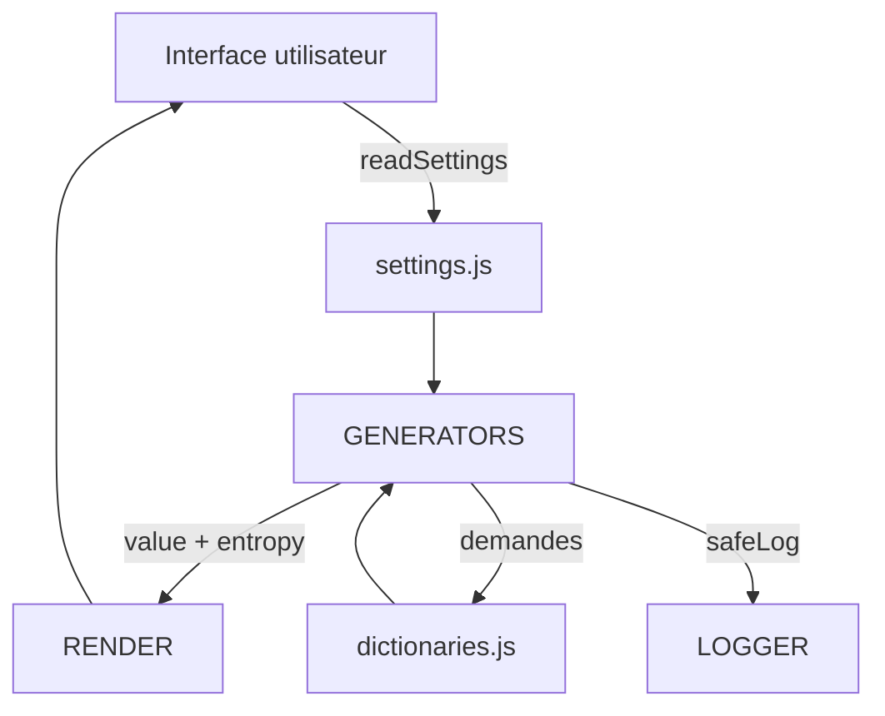

# Documentation Technique - GenPwd Pro v3.0.0

> Architecture, flux internes et outils de build/test

## Architecture modulaire ES6

GenPwd Pro est structuré autour de modules ES6 strictement fonctionnels. Chaque dossier possède une responsabilité claire.

```
src/js/
├── app.js              # Bootstrap de l'application (GenPwdApp)
├── config/
│   ├── constants.js    # Jeux de caractères, limites et dictionnaires
│   └── settings.js     # Gestion de l'état (AppState) et helpers UI
├── core/
│   ├── generators.js   # Fonctions generateSyllables / generatePassphrase / generateLeet
│   ├── dictionaries.js # Chargement asynchrone des dictionnaires
│   └── casing.js       # Gestion de la casse (applyCase / applyCasePattern)
├── ui/
│   ├── dom.js          # Initialisation DOM et caches
│   ├── events.js       # Binding des interactions utilisateurs
│   ├── modal.js        # Console de tests intégrée
│   └── render.js       # Rendu des résultats
└── utils/
    ├── clipboard.js    # copyToClipboard avec fallbacks
    ├── helpers.js      # pick, insertWithPlacement, shuffle
    └── logger.js       # safeLog (log sécurisé)
```

### Flux de données



- `readSettings()` collecte la configuration depuis le DOM et la valide.
- Les générateurs produisent des objets `GenerationResult` enrichis d'entropie.
- Les dictionnaires sont chargés à la demande via `loadDictionary()` avec fallback intégré.
- `render.js` met à jour l'interface (liste des mots de passe, entropie, badges).

## Config & état global

### `constants.js`

Le module expose des structures simples :

```javascript
export const LIMITS = {
  MIN_QUANTITY: 1,
  MAX_QUANTITY: 10,
  SYLLABLES_MIN_LENGTH: 6,
  SYLLABLES_MAX_LENGTH: 32,
  PASSPHRASE_MIN_WORDS: 3,
  PASSPHRASE_MAX_WORDS: 8,
  MIN_DIGITS: 0,
  MAX_DIGITS: 4,
  MIN_SPECIALS: 0,
  MAX_SPECIALS: 4
};

export const CHAR_SETS = {
  standard: {
    consonants: 'bcdfghjklmnpqrstvwxyz',
    vowels: 'aeiouy',
    specials: '!#%+,-./:=@_'
  },
  'standard-layout': {
    consonants: 'bcdfghjklmnpqrstvwxyz',
    vowels: 'aeiouy',
    specials: '!#%+,-./:=@_'
  },
  alphanumerique: {
    consonants: 'bcdfghjklmnpqrstvwxyz',
    vowels: 'aeiouy',
    specials: ''
  }
};
```

Les dictionnaires disponibles (`DICTIONARY_CONFIG`) y sont déclarés avec URL, drapeau et nombre attendu de mots. `FALLBACK_DICTIONARY` fournit une liste française embarquée pour les tests hors ligne.

### `settings.js`

Le fichier gère un état global `AppState` :

```javascript
const AppState = {
  settings: { ...DEFAULT_SETTINGS },
  results: [],
  blocks: ['T', 'l'],
  ui: {
    debugVisible: false,
    blockDirty: false,
    useBlocks: false,
    blockAutoSync: true
  },
  cache: {
    domElements: new Map(),
    lastPreview: ''
  }
};
```

Fonctions principales :

- `readSettings()` : lit le DOM, valide via `validateSettings()` et synchronise `AppState`.
- `setResults(results)` / `getResults()` : stockage mémoire des dernières générations.
- `getUIState(key)` / `setUIState(key, value)` : drapeaux d'interface (masquage, debug).
- `setBlocks()` / `getBlocks()` : pattern U/T/L utilisé par `applyCasePattern`.

## Générateurs

Les générateurs s'appuient sur trois primitives : `pick()` pour l'aléatoire, `applyCase`/`applyCasePattern` pour la casse et `insertWithPlacement()` pour les insertions.

### Syllables

1. Sélection de la politique (`CHAR_SETS[policy]`).
2. Construction d'une chaîne alternant consonnes/voyelles.
3. Application de la casse ou des blocs.
4. Insertion des chiffres et spéciaux via `mergeWithInsertions()`.
5. Calcul de l'entropie avec `calculateEntropy('syllables', length, charSpace)`.

### Passphrase

1. Chargement asynchrone d'un dictionnaire via `getCurrentDictionary()` (avec cache).
2. Sélection pseudo-aléatoire des mots (PRNG reproductible dans les tests).
3. Application de la casse/blocs, gestion des séparateurs.
4. Insertion chiffres/spéciaux.
5. Entropie basée sur la taille du dictionnaire (`log2(dictSize) * wordCount`).

### Leet

1. Transformation du mot de base selon la table interne `{a→@, e→3, i→1, o→0, s→5}`.
2. Application de la casse ou des blocs.
3. Insertion des chiffres/spéciaux.
4. Entropie calculée sur l'espace de caractères final.

## Calcul d'entropie interne

Les helpers privés se trouvent en fin de `generators.js` :

```javascript
function computeCharacterSpace(result) {
  let charSpace = 0;
  if (/[a-z]/.test(result)) charSpace += 26;
  if (/[A-Z]/.test(result)) charSpace += 26;
  if (/[0-9]/.test(result)) charSpace += 10;
  if (/[^a-zA-Z0-9]/.test(result)) charSpace += 32;
  return Math.max(charSpace, 1);
}

function calculateEntropy(mode, length, charSpace, wordCount = 0) {
  if (mode === 'passphrase') {
    return Math.round((Math.log2(charSpace) * wordCount) * 10) / 10;
  }
  return Math.round((Math.log2(Math.pow(charSpace, length))) * 10) / 10;
}
```

Ces fonctions ne sont pas exportées mais sont partagées entre les générateurs.

## Dictionnaires

`dictionaries.js` maintient un cache en mémoire et expose :

- `loadDictionary(dictKey)` : fetch JSON, validation (`words` string 3-12 chars), mise à jour UI (`#dict-status`, `#dict-info`).
- `getCurrentDictionary(dictKey?)` : utilise le cache, sinon fallback français.
- `setCurrentDictionary(dictKey)` : change le dictionnaire utilisé par défaut.
- `initializeDictionaries()` : configure immédiatement les informations fallback dans l'UI.

Le statut de chargement est reflété via des émojis (⏳, ✓, ✗, 🇫🇷) directement dans le DOM.

## Outils & Build

### Serveur de développement (`npm run dev`)

`tools/dev-server.js` démarre un serveur HTTP Node natif avec :

- Support ES modules (`Content-Type` adapté).
- CORS optionnel (activé par défaut).
- Cache désactivé pour le développement.
- Protection path traversal et logging coloré.
- Argument facultatif pour changer de port (`node tools/dev-server.js 8080`).

### Build personnalisé (`npm run build`)

`tools/build.js` génère un bundle autonome sans webpack :

1. Nettoie/initialise `dist/`.
2. Concatène les modules selon `moduleOrder` et supprime les `import/export`.
3. Injecte une IIFE qui instancie `GenPwdApp` à `DOMContentLoaded`.
4. Concatène les feuilles de style déclarées dans `cssFiles`.
5. Recompose `index.html` en pointant vers `genpwd-bundle.js` et CSS inline.
6. Copie les dictionnaires et assets nécessaires.

Sortie finale : `dist/index.html` autonome compatible `file://`.

### Scripts complémentaires

- `npm run test` : exécute `tools/run_tests.js` (tests Node).
- `npm run test:watch` : relance les tests lors des modifications via `nodemon`.
- `npm run test:browser` : enchaîne `tools/run_tests.js` puis un scénario navigateur (Puppeteer) lorsque le script `tools/browser-test.js` est présent.
- `npm run lint` : ESLint sur `src/js/**/*.js` et `tools/**/*.js`.

## Système de tests

`tools/run_tests.js` :

- Met en place un PRNG déterministe pour reproduire les résultats.
- Stub minimal du DOM (`document.getElementById`, `requestAnimationFrame`).
- Charge dynamiquement les modules ES6 (via `pathToFileURL`).
- Vérifie les scénarios principaux : syllables, passphrase, leet, placements, entropie.
- Peut générer un fichier de test navigateur via l'option `--create-browser-test`.

Les tests navigateur (Puppeteer) valident la console de debug, la copie presse-papiers et les interactions UI principales.

## Performance & sécurité

- Génération syllables : ≈0,8 ms par mot de passe (Node.js 20.19, M1 Pro).
- Passphrase : ≈2,1 ms (incluant chargement dictionnaire en cache).
- `safeLog` masque les valeurs sensibles et évite les exceptions console.
- CSP recommandée en production : `default-src 'self'; font-src 'self';`.
- Toutes les entrées utilisateur sont validées via `validateSettings()`.

## Ressources liées

- [Guide de développement](./DEVELOPMENT.md)
- [API Documentation](./API.md)
- [Cahier des Charges](./CDC-GENPWD-2024-v2.5.md)
- [Guide utilisateur](./USER-GUIDE.md)

---

<div align="center">
  <b>GenPwd Pro v3.0.0 - Architecture Technique</b><br />
  <i>© 2025 - Apache 2.0 License</i>
</div>
